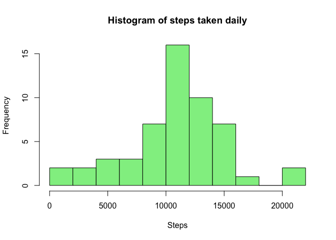
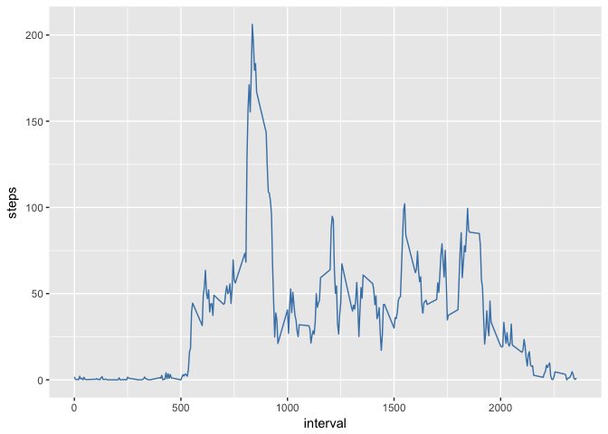
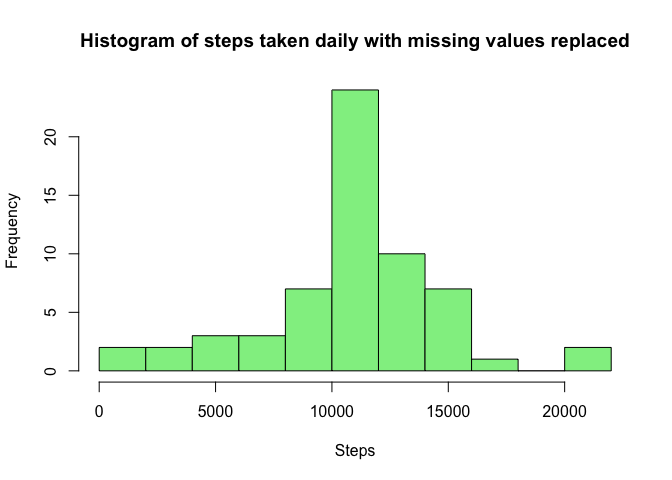
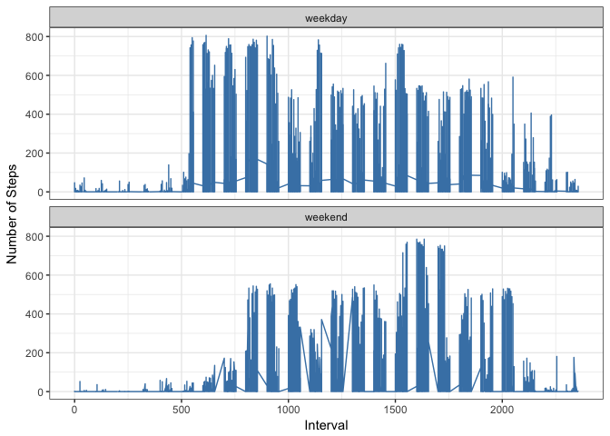

## Loading and preprocessing the data


```r
data <- read.csv("activity.csv", colClasses = c("integer", "Date", "integer"))
```

## What is mean total number of steps taken per day?

```r
stepData <- data[complete.cases(data$steps), ]
stepData <- stepData %>% group_by(date) %>% summarise(steps = sum(steps))
meanDailySteps <- as.integer(mean(stepData$steps))
medianDailySteps <- as.integer(median(stepData$steps))
hist(stepData$steps, breaks = 10, main = "Histogram of steps taken daily", xlab = "Steps", col="lightgreen")
```

<!-- -->

The **mean** number of daily steps is 10766.  
The **median** number of daily steps is 10765.  
(For the purposes of simplicity / readability, I've rounded to a whole step.)  

## What is the average daily activity pattern?

```r
intervalData <- data[complete.cases(data$steps), ]
intervalData <- intervalData %>% group_by(interval) %>% summarise(steps = mean(steps))
ggplot(intervalData, aes(interval, steps)) + geom_line(color='steelblue')
```

<!-- -->

```r
intervalWithMostSteps <- intervalData[which.max(intervalData$steps), ]$interval
```

The interval with the most average steps each day is **835**.

## Inputing missing values

```r
missingValues <- sum(!complete.cases(data)) 
```
There are **2304** rows that are incomplete or lack data.

We can replace the missing step values with their equivalent interval average. 


```r
data <- data %>% 
    group_by(interval) %>% 
    mutate(steps = ifelse(is.na(steps), mean(steps, na.rm = TRUE), steps))
```

```
## Warning: package 'bindrcpp' was built under R version 3.4.4
```

We then calculate the changes to the histogram by filling in these missing values.


```r
filledStepData <- data %>% group_by(date) %>% summarise(steps = sum(steps))
meanFilledDailySteps <- as.integer(mean(filledStepData$steps))
medianFilledDailySteps <- as.integer(median(filledStepData$steps))
hist(filledStepData$steps, breaks = 10, main = "Histogram of steps taken daily with missing values replaced", xlab = "Steps", col="lightgreen")
```

<!-- -->

The **mean** number of daily steps after NA replacement is 10766.  
The **median** number of daily steps after NA replacement is 10766.  These values very little from their unfilled counterparts due to the replacement method. There is no great discernible change from the total daily amount of steps show in the histogram, though the histogram shows (rightly) that the frequency of the steps reported has increased. 


## Are there differences in activity patterns between weekdays and weekends?

Firstly, let's create a factor variable and add it to the column, indicating whether the dates are weekends or not.  


```r
data <- data %>% 
    mutate(dayType = ifelse(weekdays(date) %in% c("Saturday", "Sunday"), "weekend", "weekday"))

ggplot(data, aes(interval, steps)) + geom_line(color = "steelblue") +
    facet_wrap(~dayType, nrow=2) +
    labs(x = "Interval", y = "Number of Steps") +
    theme_bw()
```

<!-- -->

As the graphs shows, weekends tend to have a later start and, at a glance, a lower average step rate, as well as less consistent activity. 
